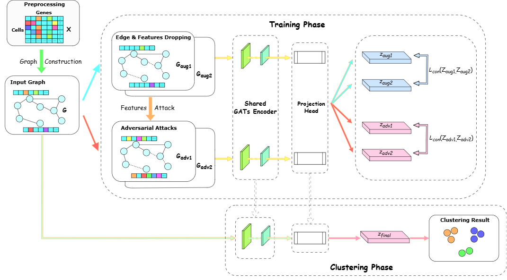

# scGAAM: Single-cell RNA-seq Clustering with Adversarial attack and Attention mechanism

[](https://www.i-somet.org/somet2026/index.html)
[](https://www.python.org/)
[](https://pytorch.org/)

This repository contains the official implementation of **scGAAM**, a novel deep learning framework for single-cell RNA-seq (scRNA-seq) data clustering. This paper has been accepted at **SOMET 2026**.

## 📖 Abstract
Single-cell RNA sequencing (scRNA-seq) technologies provide the ability to analyze biological mechanisms at the cellular level. Separating cells into clusters of cell types is a key task in single-cell data analysis. Although recent studies have leveraged the strengths of deep learning techniques, the high dimensionality and noise in the data still pose significant research challenges. 

This work proposes an enhanced clustering method for single-cell RNA-seq, called **scGAAM**, with the integration of adversarial attacks and attention mechanisms in graph contrastive learning. Experiments on real scRNA-seq datasets show that the proposed method outperforms state-of-the-art algorithms.

<p align="center">
  <!-- TODO: Upload your Figure 1 to the repo and update this image path -->
  
  <br>
  <em>Figure 1: The overall architecture of scGAAM</em>
</p>

## 📁 Repository Structure

The repository contains the following 6 core Python files:

*   `scGAAM.py`: The main entry point to run the model. It handles argument parsing, data loading, model initialization, and outputs the final clustering metrics (ARI and NMI).
*   `train.py`: Contains the main training loop, implementing subgraph sampling, data augmentation (gene/edge dropping), and the adversarial attack generation per epoch.
*   `model.py`: Defines the `HybridGATModel` architecture, projection heads, and the InfoNCE contrastive loss functions (`semi_loss`, `batched_semi_loss`).
*   `GATEncoder.py`: Implementation of the Graph Attention Network (GAT) backbone specifically tailored for sparse matrix operations to handle large scRNA-seq graphs efficiently.
*   `GNNEncoder.py`: A simple Graph Neural Network encoder used primarily as a baseline/ablation module (NoGAT variant) to evaluate the effectiveness of the attention mechanism.
*   `utils.py`: Utility functions for loading data (`load_h5_data1`), preprocessing (using Scanpy), building the k-NN graph with Pearson correlation (`GraphConstruction`), executing augmentations, and running Projected Gradient Descent (PGD) adversarial attacks.

## ⚙️ Requirements & Installation

We recommend using a virtual environment (e.g., Conda) to run scGAAM.

```bash
# Create a new conda environment
conda create -n scgaam python=3.9 -y
conda activate scgaam

# Install PyTorch & PyTorch Geometric (Adjust CUDA version to match your hardware)
pip install torch torchvision torchaudio --index-url https://download.pytorch.org/whl/cu118
pip install torch_geometric

# Install other dependencies
pip install scanpy scikit-learn pandas numpy scipy networkx h5py torch_scatter

## 🚀 Usage & Quick Start

### 1. Data Preparation
By default, the script looks for `.h5` datasets in a `./data/` directory. Create the folder and place your datasets inside:
```bash
mkdir data
# Place datasets like Pollen.h5, Goolam.h5, etc. into the data folder
```

### 2. Running the Model
You can run the model using the `scGAAM.py` script. Here is an example of running the model on the `Pollen.h5` dataset with 8 clusters:

```bash
python scGAAM.py \
    --data_file Pollen.h5 \
    --num_cluster 8 \
    --lam 1.0 \
    --learning_rate 0.0005 \
    --num_epochs 500
```

### 3. Command Line Arguments

| Argument | Type | Default | Description |
| :--- | :---: | :---: | :--- |
| `--data_file` | `str` | `Pollen.h5` | Name of the input dataset file inside the `./data/` folder. |
| `--num_cluster` | `int` | `8` | Expected number of cell clusters. |
| `--lam` | `float` | `1.0` | Weight of the adversarial contrastive loss ($\lambda$). |
| `--subgraph_size` | `int` | `400` | Number of nodes to sample for subgraph training per epoch. |
| `--learning_rate` | `float` | `0.0005`| Learning rate for the Adam optimizer. |
| `--tau` | `float` | `0.5` | Temperature parameter for the InfoNCE contrastive loss. |
| `--num_epochs` | `int` | `500` | Number of training epochs. |
| `--num_itersAdv` | `int` | `10` | Number of iterations for the PGD adversarial attack. |
| `--random_seed` | `int` | `11111` | Random seed for reproducibility. |

The script will automatically print the **Adjusted Rand Index (ARI)** and **Normalized Mutual Info (NMI)** scores upon completion, and append the run logs to a file in the `./result/` directory.

## 🔬 Ablation Studies
To run the model without the Graph Attention Network (using standard GCN layers) or without Adversarial Attacks (NoAdv), you can modify the initialization in `scGAAM.py` to use `SimpleGNNModel` (NoGAT) or set `--lam 0.0` (NoAdv). 

## 📝 Citation
If you find our work or this code useful in your research, please consider citing our SOMET 2026 paper:

```bibtex
@inproceedings{scGAAM2026,
  title={Single-cell RNA-seq Clustering with Adversarial attack and Attention mechanism},
  author={Your Name and Co-authors},
  booktitle={Proceedings of the International Conference on Software Engineering and Knowledge Engineering (SOMET)},
  year={2026}
}
```
*(Please update the author list and citation details once the official proceedings are published).*

## 🙏 Acknowledgements
This repository is built upon several excellent open-source works. We would like to express our gratitude to the authors of:
*   [scAGCL](https://github.com/levinhcntt/scAGCL)
*   [ARIEL](https://github.com/Shengyu-Feng/ARIEL)
*   [pytorch-GAT](https://github.com/gordicaleksa/pytorch-GAT)
*   [scziDesk](https://github.com/xuebaliang/scziDesk)
```

### 💡 Tips for Finalizing:
1.  **Image upload:** Be sure to create a folder called `images` in your repository, save the architecture diagram from your PDF as `architecture.png`, and upload it there so the image in the README renders correctly.
2.  **Authors list:** Update the `@inproceedings` BibTeX placeholder with the real author names.
3.  **Create result dir:** You might want to ensure a `result` directory exists, or add a quick `os.makedirs('./result/', exist_ok=True)` in your python script to prevent errors during logging.
